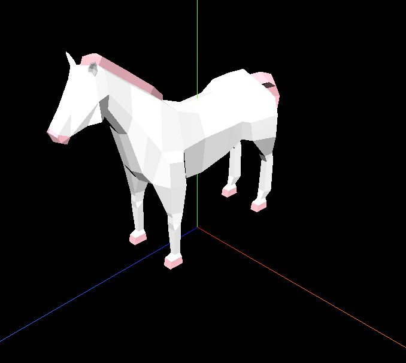

## 3D场景加载外部模型

我们用 GLTFLoader 加载了一匹马的 gltf 模型。

一些复杂的物体用 Three.js 的几何体画不太现实，一般都是用建模软件画，然后导出 gltf 等格式的模型文件，我们在代码里用 GLTFLoader 加载进来。

scene 属性就是一个 Group，我们把它加到 Scene 里就可以了，它的 children 就是一些网格模型，可以随意修改材质等，和其他网格模型没区别。

比如可以用 traverse 遍历对象树，用 isMesh 方法判断是否是网格模型，或者用 getObjectByName 来按照名字查找等。

绝大多数 3D 场景都是要加载外部的网格模型的，不可能全部自己画，而模型文件格式里最常用的就是 gltf，后面的实战我们也会用到 gltf 模型。

### 创建项目
- 创建`index.html`
```html
<!DOCTYPE html>
<html lang="en">
<head>
  <meta charset="UTF-8">
  <meta name="viewport" content="width=device-width, initial-scale=1.0">
  <title>Document</title>
  <style>
    body {
        margin: 0;
    }
  </style>
</head>
<body>
  <script type="importmap">
    {
      "imports": {
        "three": "https://esm.sh/three@0.174.0/build/three.module.js",
        "three/addons/": "https://esm.sh/three@0.174.0/examples/jsm/"
      }
    }
  </script>
  <script type="module" src="./main.js"></script>
</body>
</html>
```

```bash
# 安装three的提示包
npm install --save-dev @types/three
# 创建main.js  mesh.js
touch main.js
touch src/mesh.js
```

### 放入gltf模型文件
- 放入`Horse.bin`和`Horse.gltf`文件到`src/model`下面
- 在`mesh.js`中引用模型

```js
//mesh.js
import * as THREE from 'three';
import { GLTFLoader } from 'three/addons/loaders/GLTFLoader.js';
// 模型加载器
const loader = new GLTFLoader();
// 物体组 new THREE.Group来加载模型
const mesh = new THREE.Group();
// 使用loader.load加载模型
// ./src/model/Horse.gltf 为实际可访问地址。
// 在react或vue中要放到public文件夹（）
loader.load("./src/model/Horse.gltf", function (gltf) {
  console.log(gltf);
  // mesh使用模型
  mesh.add(gltf.scene);
  // gltf模型放大20倍
  gltf.scene.scale.set(20, 20, 20);
  // 遍历模型的子网格模型
  gltf.scene.traverse(obj => {
    if(obj.isMesh) {
      console.log('mesh', obj) // horse模型有两个子网格
      if(obj.name === "Cylinder") { // horse的躯体
        obj.material.color = new THREE.Color('white');
      } else if(obj.name === "Cylinder_1") { // horse的鬓毛和蹄子
        obj.material.color = new THREE.Color('pink');
      }
    }
  })
})

export default mesh;
```
